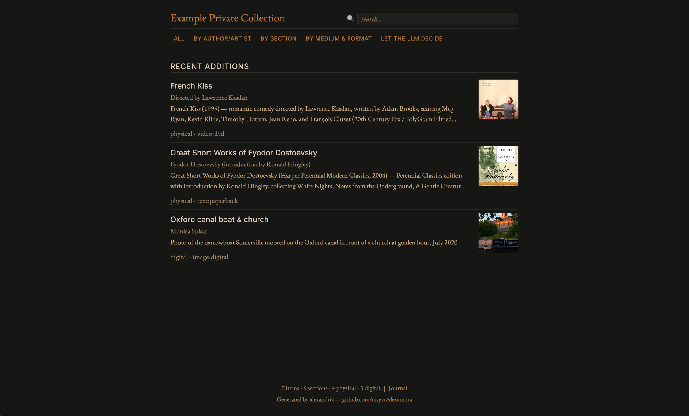

## alexandria

- [Alexandria as a project](#alexandria-as-a-project) — a way to build and maintain a private, locally-owned collection of items and live knowledge resources, with or without an LLM in the loop.
- [Alexandria as a private collection](#alexandria-as-a-private-collection) — build your own collection alongside Claude Code, and develop the working fluency to retain control of your digital material as AI proliferates.

### Components

| Component | Required? | Locality |
| --- | --- | --- |
| [Python 3.10+](https://python.org/downloads) | Required | Local |
| [uv](https://docs.astral.sh/uv/) | Required | Local |
| Git | Required | Local |
| [Claude Code](https://claude.ai/claude-code) | Required to create/edit; optional to browse | Third-party required |
| [Claude Pro subscription](https://claude.com/pricing) | Required for Claude Code | Third-party required |
| GitHub account | Optional (backup, sharing, browser/phone use) | Optionally third-party |
| Local open-source LLM | Optional (planned librarian) | Local |

Once a collection is built, browsing, regenerating the wiki, and reading items work fully offline with no AI subscription. Claude Code is needed only when creating items and for the LLM-driven scout flow. The long-term direction is for the default librarian to be a local open-source model — Claude will remain the default only where its quality meaningfully matters.

### Alexandria as a project

A way to build and maintain a curated collection of items — books, papers, files, notes, and active research scouts — that lives as plain files on your machine. Equally useful for cataloging an existing library, organizing personal research, or maintaining a current knowledge resource on a topic that matters to you. The same shape works with or without an LLM in the loop.

What sets it apart from existing library and collection tools:

- **Files you own.** Each item is plain markdown + YAML in a directory you can read, copy, version, or migrate without any tooling. No database, no proprietary format, no service to lose access to.
- **One shape across all item types.** Physical books, PDFs, web pages, photographs, audio, and active research scouts share the same outer structure (catalog entry, content, README). The wiki, search, and indexes work uniformly across types.
- **LLM-optional after build.** Browsing, indexing, regenerating the wiki, reading, and editing run on local Python with no network calls. The LLM is needed only for new items and scout maintenance.
- **Active and static items together.** Most items are static catalog entries; "scouts" are AI-curated knowledge bases on topics you care about, kept current — and settled into static references when you decide. A real library has both.
- **Self-contained.** Each collection ships with the tools, skills, and fonts it needs. Move the directory to another machine and it still works.

For the full thesis and project direction, see [ASPIRATIONS.md](docs/ASPIRATIONS.md).

### Alexandria as a private collection

A path to the working fluency you need to retain control of your own digital material in the presence of AI — built by actually doing it, on a real collection that's yours when you finish.

**What you'll have at the end:**

- Your own private collection, structured like a library, in a directory on your machine.
- Working fluency in: terminals, structured data (YAML, markdown), version control (git), and directing an AI assistant to do useful work and verifying its output.

**Prerequisites:**

- A computer with a terminal (macOS, Linux, or Windows with WSL).
- A [Claude Code](https://claude.ai/claude-code) account, with a [Pro subscription](https://claude.com/pricing) (~$20/month).
- Willingness to follow a walkthrough at the pace it needs.

No prior technical background is expected. Each skill comes up in the course of the work, when there is something concrete to apply it to.

**Get started:** the [setup walkthrough](docs/guides/setup-walkthrough.md) shows every command, in order, with explanations.

#### Item types

Three item types share one outer shape (README, metadata.yaml, content):

- **Physical** — a record of something you own. Photograph it once; metadata is extracted and confirmed. Run `/coll-physical`.
- **Digital** — a file, URL, or pasted text brought into the collection. The original is preserved exactly. Run `/coll-digital`.
- **Scout** — an AI-curated knowledge base on a topic. Maintained while it is evolving; settled into a static item when you decide. Run `/coll-new-scout`.

#### Day-to-day

From inside your collection directory, `/coll-menu` opens a guided menu (add, browse, regenerate wiki, remove, reorganize). Direct commands like `/coll-physical`, `/coll-digital`, `/coll-notes`, and `/coll-rename` work too. The wiki regenerates automatically after each change.

### Why this matters

The motivation is practical. As AI takes on more of the work of making, editing, and organizing digital material, retaining control of one's own work has begun to depend on a small, practical fluency. Not programming — a narrower set: enough terminal to navigate and recover, enough structured text to read a YAML file, enough command of an AI assistant to direct and correct its work, enough sense of what a file is to know when you own it. People who have that fluency can remain in control as AI advances. People who do not are increasingly renting the capability from whoever made the nearest app.

---

### What's in this repo

#### Skills

- [/coll-build-new-collection](.claude/skills/coll-build-new-collection/SKILL.md) — create a new collection (run once from the alexandria repo)
- [/coll-menu](.claude/skills/coll-menu/SKILL.md) — guided menu for all collection actions
- [/coll-physical](.claude/skills/coll-physical/SKILL.md) — catalog a physical item from a photo or manual entry
- [/coll-hardcover](.claude/skills/coll-hardcover/SKILL.md) — shortcut for a hardcover (calls /coll-physical with media_type pre-set)
- [/coll-paperback](.claude/skills/coll-paperback/SKILL.md) — shortcut for a paperback
- [/coll-digital](.claude/skills/coll-digital/SKILL.md) — bring digital content (files, URLs, text) into the collection
- [/coll-new-scout](.claude/skills/coll-new-scout/SKILL.md) — create a new scout for any topic
- [/coll-scout](.claude/skills/coll-scout/SKILL.md) — import an existing scout into the collection
- [/coll-notes](.claude/skills/coll-notes/SKILL.md) — save notes about an item or the collection
- [/coll-add-item-notes](.claude/skills/coll-add-item-notes/SKILL.md) — add personal notes to an item (from a .md, .txt, or .pdf file)
- [/coll-rename](.claude/skills/coll-rename/SKILL.md) — rename the collection (display name and optionally directory)
- [/coll-import-collection](.claude/skills/coll-import-collection/SKILL.md) — import all items from another collection into this one
- [/coll-update-from-latest-alexandria](.claude/skills/coll-update-from-latest-alexandria/SKILL.md) — update skills to the latest version from the alexandria repo

#### Guides

- [Setup walkthrough](docs/guides/setup-walkthrough.md) — every command for first-time setup, with explanations
- [Terminal basics](docs/guides/terminal-basics.md) — directories, git repos, Claude Code sessions, running multiple sessions with tabs
- [Python and uv](docs/guides/python-and-uv.md) — what Python, dependencies, uv, and git are (one paragraph each) and why you need them
- [YAML basics](docs/guides/yaml-basics.md) — reading and editing metadata.yaml files
- [Anatomy of an item](docs/guides/anatomy-of-an-item.md) — what's inside an item directory, what each file does, what you can safely change
- [Working with scouts](docs/guides/working-with-scouts.md) — the scout lifecycle: creating, maintaining, settling, importing
- [Fonts and typography](docs/guides/fonts-and-typography.md) — which fonts ship with the wiki, why they're self-hosted, how to swap them
- [Troubleshooting](docs/guides/troubleshooting.md) — common issues and how to fix them

#### Reference docs

- [docs/collection/](docs/collection/) — collection-level specs (universal item shape)
- [docs/scout/](docs/scout/) — scout process phases, critique checklist, schema patterns, walkthroughs

#### Project direction

- [ASPIRATIONS.md](docs/ASPIRATIONS.md) — project vision, collection architecture, technical minimalism, planned item types
